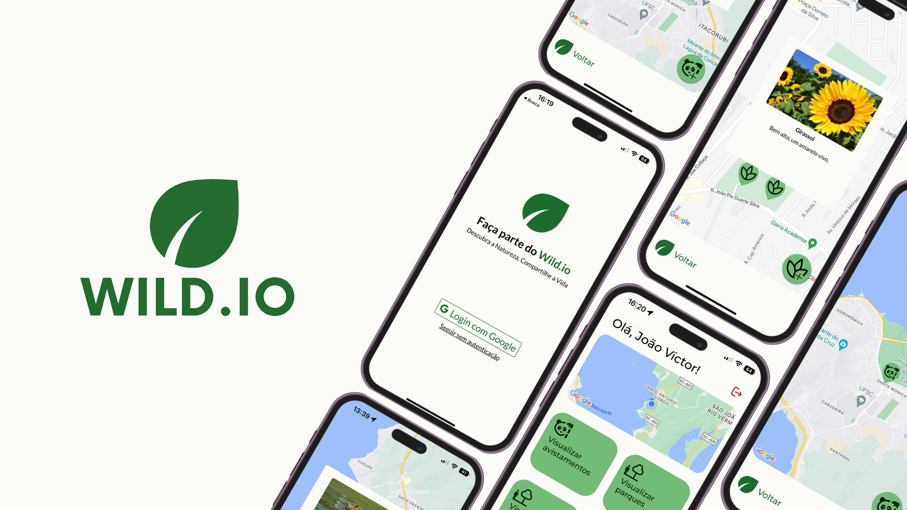

# Wild.io



## Introduction

Wild.io is a platform that encourages urban biodiversity by enabling users to register parks and document flora and fauna within city spaces. This project, developed as my final college project, was designed to increase interest and engagement with public urban parks. 

## Technologies

The application was created using the following technologies:

- **React Native**: A JavaScript framework for building native mobile apps.
- **Expo**: An open-source platform for making universal native apps for Android, iOS, and the web with JavaScript and React.
- **Node.js**: Asynchronous event-driven JavaScript runtime.
- **Express**: A minimal and flexible Node.js web application framework.
- **MongoDB**: A source-available cross-platform document-oriented database.
- **Mongoose**: MongoDB object modeling tool designed to work in an asynchronous environment.
- **Axios**: Promise based HTTP client for the browser and Node.js.

## Features

Wild.io has several features including:

- User authentication 
- Ability for users to register parks
- Ability for users to document flora and fauna
- Location-based services to find parks and fauna/flora sightings near you
- An engaging and interactive UI/UX

## Setup

To run this project locally, you'll need to have Node.js, npm and Expo CLI installed on your computer. From your command line:

1. Clone this repository and navigate into it:
```bash
git clone https://github.com/ArantesJoao/wild-io.git
cd wild-io
```

2. Install dependencies:
```bash
npm install
```
3. Start the project with Expo:
```bash
expo start
```

A new browser window should open up with Metro Bundler. From here, you can run the app on your Android or iOS simulator, or on your mobile device using the Expo Go app.

## Acknowledgements
I want to express my gratitude to my professors who provided invaluable feedback and support during the development of this project.

Feel free to reach out to me [on LinkedIn](https://www.linkedin.com/in/joaovictorarantes) you have any questions or would like to work with me!


Enjoy exploring Wild.io! 😊
